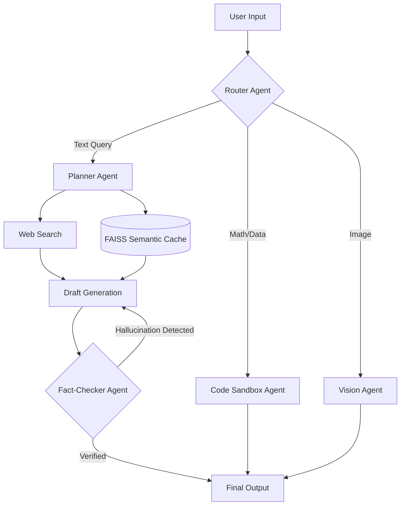

# 🧠 Autonomous AI Research Agent

<div align="center">
  
  
  
  
  
  
  [](https://github.com/jagannadharao8/ai-research-agent/actions/workflows/python-tests.yml)

  **An enterprise-grade, autonomous AI research assistant powered by Multi-Agent Workflows.**<br>
  *Created by **Jalla Jagannadharao***

</div>

<br/>


## 📖 Overview
This application goes far beyond standard RAG (Retrieval-Augmented Generation). It utilizes a sophisticated **multi-agent architecture** capable of autonomous query decomposition, self-correcting fact-checks, multimodal vision, and dynamic Python code execution in a secure sandbox.

---

## ⚡ Key Features

### 🧩 Agentic Query Planner
Instead of executing a single linear search, the AI acts as an autonomous planner. It intercepts complex user queries, breaks them down into multiple sub-tasks, executes parallel web searches via the DuckDuckGo API, and synthesizes a comprehensive final report.

### 🔄 Self-Correcting Reflection Loops
AI hallucinations are mathematically mitigated through an autonomous reflection loop. A secondary **Fact-Checker Agent** reviews the primary agent's draft against the retrieved sources. If citations are unsupported, the Fact-Checker rejects the draft and forces the main agent to rewrite the answer before it is displayed to the user.

### 📊 Sandboxed Code Interpreter
Equipped with a secure Python execution environment, the agent can write and run Python scripts dynamically. Users can upload `.csv` or `.xlsx` datasets, and the agent will use Pandas and Matplotlib to analyze the data, compute statistics, and render mathematical charts directly in the chat interface.

### 🕸️ Interactive Knowledge Graphs
Powered by `streamlit-agraph`, the system automatically extracts entities and relationships from the generated research report and renders them as a drag-and-drop interactive Knowledge Graph, allowing users to visually map complex topics.

### 👁️ Multimodal Vision
Supports image uploads (PNG, JPG) using Groq's Vision models (Llama 3.2 Vision), allowing users to chat with and analyze visual documents, charts, and diagrams natively.

### 🚀 Semantic Caching & Enterprise Exports
- **FAISS Vector Caching**: Identical or semantically similar queries are served instantly from a FAISS vector database, drastically reducing API latency and saving token costs.
- **Automated Reports**: Instantly download research results as beautifully formatted PDF, Microsoft Word (.docx), or Markdown files.

---

## 🏗️ System Architecture



---

## 🛠️ Technology Stack
- **Frontend**: Streamlit, Streamlit-Agraph
- **AI Models**: Groq (`llama-3.3-70b-versatile` for reasoning, `llama-3.2-11b-vision-preview` for Multimodal)
- **Vector Database**: FAISS (Facebook AI Similarity Search), HuggingFace Sentence Transformers (`all-MiniLM-L6-v2`)
- **Tools**: DuckDuckGo API, PyPDF2, Python-Docx, Subprocess (Code Sandbox)

---

## 📦 Installation & Setup

1. **Clone the repository:**
   ```bash
   git clone https://github.com/jagannadharao8/ai-research-agent.git
   cd ai-research-agent
   ```

2. **Create a virtual environment:**
   ```bash
   python -m venv venv
   source venv/bin/activate  # On Windows use: venv\Scripts\activate
   ```

3. **Install dependencies:**
   ```bash
   pip install -r requirements.txt
   ```

4. **Environment Variables:**
   Create a `.env` file in the root directory and add your Groq API key:
   ```env
   GROQ_API_KEY=your_groq_api_key_here
   ```

5. **Run the Application:**
   ```bash
   streamlit run ui/app.py
   ```

---

## 🔒 Security Note
The Python Code Interpreter runs in a temporary directory with a strict 15-second execution timeout to prevent infinite loops. In a production cloud environment, this sandbox should be further isolated using Docker containers or gVisor.

---
<div align="center">
  <i>Built with ❤️ for the future of Autonomous AI.</i>
</div>
